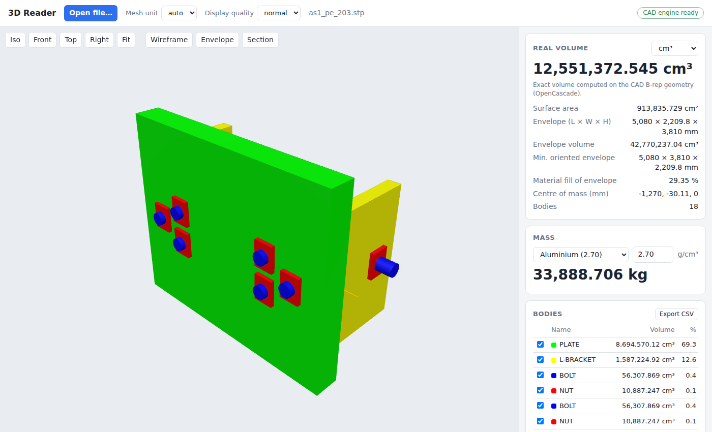

# 3D Reader

A web application that opens 3D files (STEP and most other 3D formats), shows them
in the browser, and computes the **real volume of material** of each part, not only
the bounding envelope ("encombrement").

**Online version** (once published, see [Publishing on GitHub Pages](#publishing-on-github-pages)):
https://alexdevanssay-cmyk.github.io/3D-reader/



## Features

- **Formats**
  - CAD (exact geometry, via OpenCascade): **STEP** (`.step`, `.stp`), **IGES** (`.iges`, `.igs`), **BREP**
  - Meshes: **STL**, **OBJ**, **PLY**, **OFF**, **glTF/GLB**, **3MF**, **DAE**
- **Real volume**
  - STEP/IGES/BREP: exact volume integrated over the true B-rep surfaces (planes,
    cylinders, NURBS...) with OpenCascade `BRepGProp`. It does not depend on the
    display tessellation. The volume of the display mesh is also given for comparison.
  - Meshes: volume enclosed by the closed triangle surface (divergence theorem).
    Inverted normals and inconsistent winding are repaired. Open meshes are flagged.
    When the holes are small enough to fill, the volume is given as an estimate.
  - Surface models (STEP/IGES without solids, even with one part per face) are sewn
    into solids when they close.
- **Envelope**: axis-aligned bounding box (L × W × H and its volume), the minimum
  oriented bounding box, and the **fill ratio** (material volume ÷ envelope volume).
- Surface area, centre of mass, and **mass** from a material density (preset list or custom).
- Assemblies: one row per part with names and colours from the STEP file, per-part
  volume and share, show/hide, and click a part in 3D to select it.
- Viewer: orbit, pan, zoom, standard views, wireframe, envelope display, section plane.
- CSV export of the per-part results.
- Units: everything is reported in mm / mm² / mm³ (switchable to cm³, dm³, m³, in³).
  CAD files are converted from their own unit automatically. Mesh files have no unit,
  so choose it (auto = mm, or metres for glTF, or the unit stored in 3MF/DAE).

## Two engines, same results

| | Online version (GitHub Pages) | Python version |
|---|---|---|
| Where it runs | in the visitor's browser (WebAssembly) | on your machine / a server |
| CAD engine | OpenCascade compiled to WebAssembly (`opencascade.js`) | OpenCascade (`cadquery-ocp`) |
| Mesh engine | three.js loaders + `web/engine/meshanalysis.js` | trimesh |
| Install | nothing, open the URL | Python 3.10 – 3.12 |
| Your files | never leave the browser | uploaded to the server you run |
| Extras | — | command line, HTTP API, `.zae`, `.3dxml` |

GitHub Pages only serves static files and cannot run Python, which is why the online
version computes in the browser. Both engines use OpenCascade's exact B-rep integration
for CAD files, and the test suite checks that they give the same numbers on the same
files (`tests/make_fixtures.py` writes the reference results of the Python engine, the
JavaScript tests compare against them).

The first STEP/IGES file opened online downloads the CAD engine (about 14 MB, then
cached by the browser). Mesh files do not need it.

## Python version

### Installation

On Linux without a desktop (servers, Docker slim images, WSL), install the OpenGL
runtime OpenCascade links against first: `sudo apt-get install libgl1` (Debian/Ubuntu)
or `sudo dnf install mesa-libGL` (Fedora).

```bash
python -m venv .venv
source .venv/bin/activate        # Windows: .venv\Scripts\activate
pip install -r requirements.txt
```

### Web interface

```bash
python -m reader3d serve           # then open http://127.0.0.1:8000
python -m reader3d serve --host 0.0.0.0 --port 8080   # reachable from the network
```

Drop a file in the window, or use **Open file…**. When the browser engine is also
available (after `npm ci && npm run vendor`), an **Engine** selector lets you choose
between the Python server and the browser.

### GitHub Codespaces

The repository contains a dev container: **Code → Codespaces → Create codespace** on
GitHub installs everything and starts the Python server; the forwarded port 8000 opens
the app in a URL like `https://<codespace>-8000.app.github.dev`. A codespace stops
after a period of inactivity, so use GitHub Pages for a permanent URL.

### Command line

```bash
python -m reader3d analyze part.step
python -m reader3d analyze scan.stl --unit cm
python -m reader3d analyze part.step --json     # full result as JSON
```

### HTTP API

`POST /api/analyze` (multipart form) with `file`, plus optional `unit`
(`auto|mm|cm|m|in|ft`) and `quality` (`coarse|normal|fine`, display tessellation only).
It returns JSON with a `summary` (total volume, area, envelope, fill ratio, centre of
mass) and `bodies` (per part, including the display mesh as base64 arrays).

## Publishing on GitHub Pages

The workflow `.github/workflows/pages.yml` builds the static site (`npm run build` →
`dist/`) and publishes each commit of `main` once CI (`.github/workflows/ci.yml`: Python
tests, browser engine against the Python results, end-to-end tests) has passed on it.
One-time setup, by the owner of the repository:

1. GitHub Pages on a **private** repository requires a paid plan (Pro, Team or
   Enterprise). On a free account, make the repository public first
   (**Settings → General → Danger Zone → Change visibility**). The published site
   is public either way.
2. **Settings → Pages → Build and deployment → Source: GitHub Actions.**
3. Merge this work into `main`. The deployment then runs after CI; it can also be
   started by hand from the **Actions** tab (**Deploy to GitHub Pages → Run workflow**).
   The URL is shown in the workflow run and under **Settings → Pages**.

Build and preview the static site locally:

```bash
npm ci
npm run build        # writes dist/
npm run serve        # http://127.0.0.1:8080
```

## Project layout

```
reader3d/              Python engine and server
  cad.py               STEP / IGES / BREP reading, exact volumes (OpenCascade)
  mesh.py              mesh formats, closed-mesh volume, repairs (trimesh)
  model.py             result types, totals, bounding boxes
  analyze.py           format dispatch
  server.py            FastAPI app (serves web/ + /api/analyze)
web/                   the web interface (static site)
  app.js               viewer and results panel
  engine/              browser engine
    client.js          main-thread API (mesh parsing, envelopes)
    worker.js          Web Worker running the heavy computations
    occt.js, cad.js    OpenCascade WebAssembly: exact CAD volumes
    meshload.js        mesh formats (three.js loaders)
    meshanalysis.js    closed-mesh volume, repairs
    summary.js         totals, bounding box, minimum oriented box
  vendor/              three.js (committed), OpenCascade (generated by npm run vendor)
scripts/               static build and local static server
tests/                 pytest suite, cross-engine fixtures, JS and end-to-end tests
.github/workflows/     CI (all tests) and GitHub Pages deployment
.devcontainer/         GitHub Codespaces configuration
```

## Tests

```bash
pip install -r requirements-dev.txt
pytest                                   # Python engine
python tests/make_fixtures.py            # reference files + Python results
npm ci && npm test                       # browser engine vs Python results
npx playwright install chromium          # once: the browser for the end-to-end tests
npm run build && npm run test:e2e        # the built site in a headless browser
```

The tests build parts with known analytic volumes (a holed block, spheres, cylinders,
STEP written in metres, a surface model, a named and coloured assembly…) and check the
results to 1e-9 relative precision, then check that both engines agree.
